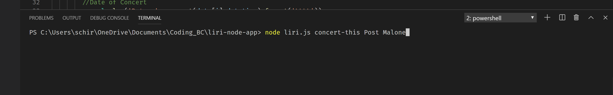
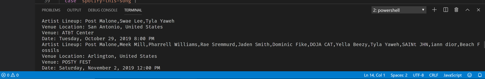
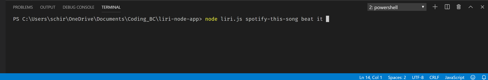
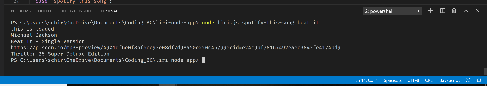
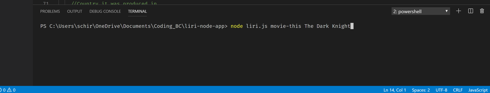
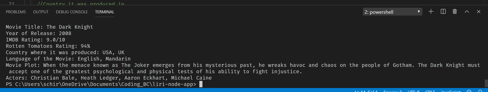
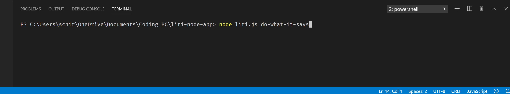
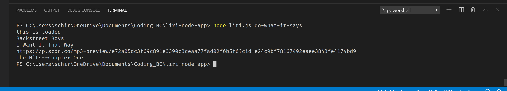

# liri-node-app
## What is Liri
Liri is an app that allows you to search Spotify for songs, Concerts for bands, and OMDB for movies. It is a node app that takes commands in the command line and gives you back the data from these node/API's. With this app you can search your favorite songs and see when they came out. You can see when your favorite artist is going to be performing near you. Or you can look up your favorite movie and see when it came out, what the ratings were, or what its about.

## The code behind Liri
To get Liri to work I had to utilize the 3 APIs that are required for this assignment. Those APIs are 
1. Node-Spotify-API
2. Bands-in-Town API
3. OMDB Movies API

The first thing I did was download Axios so that I could grab the bands API and the OMDB API, as for the spotify API it is actually a node package itself so I downloaded that as well. First to install these node packages was I had to 
1. NPM init -y
2. NPM i(install) **<Node Package>**
3. Require the node packages so that you are able to utilize them.
Besides Axios and spotify I also downloaded moment and .env. After downloading the necessary node packages and required them to be able to utilize them. For the spotify API you have to create a ID and Secret from spotify so I created a .env file and a .gitignore file so that it was hidden and nobody else could use my ID and Secret. If you were to download the code you would have to provide your own. I created functions for each API so that I pulled specific data from each one. Once I had each API working the way I wanted I threw them into a switch statement, which is based off the command you give. Each of the commands are listed below, but when you type in a specific command you will have to type in an input following the command and it will give you the information. 

## How to use Liri
The first thing to know about liri is that is uses node.js and therefore works through the terminal. In order to work it you must enter in the following first: 'node liri.js <command> <input>'. After that you have 4 commands at your disposal that allow you to interact with Liri. The following commands are: 

### 1) concert-this
This command allows you to search up your favorite artist or band and see when there next events are. It will provide the artists that will be performing there, city and country, name of the venue, and the Date of the concert as well as the time. When you input to search for a band it should look like this...

When you press enter you should get this result

### 2) spotify-this-song
This command allows you to search any song you like and through the spotify API it will bring up the artist, name of the song, a preview url of the song, and the name of the album its from. The input for this command should look like this...

The result should look like this

### 3) movie-this
This command allows you to search up your favorie movie using the OMDB API and it will return the movie title, the year it was released, the IMDB rating, the Rotten Tomatoes rating, the country or countries it was produced in, the language the movie is in, the movie plot, and the actors that are starring in the movie. The command input for this should look like this...

What you will see when you press enter should look something like this

### 4) do-what-it-says
The last command is if you don't have any specific movie, artist, or song in mind you can just tell liri to do what it says and it will read from a file and pull up a request that has been made in that file. This command will look something like this...

and your result will be this

### If you need help refer to the images for instructions on how to correctly type your input into the command line